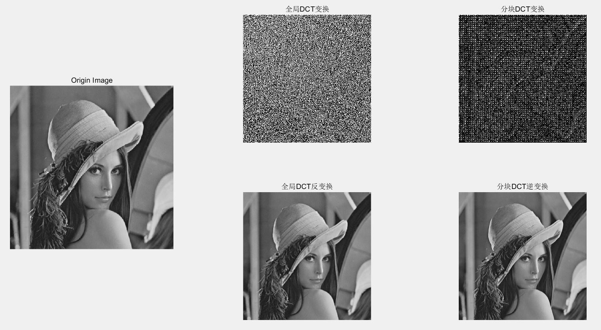
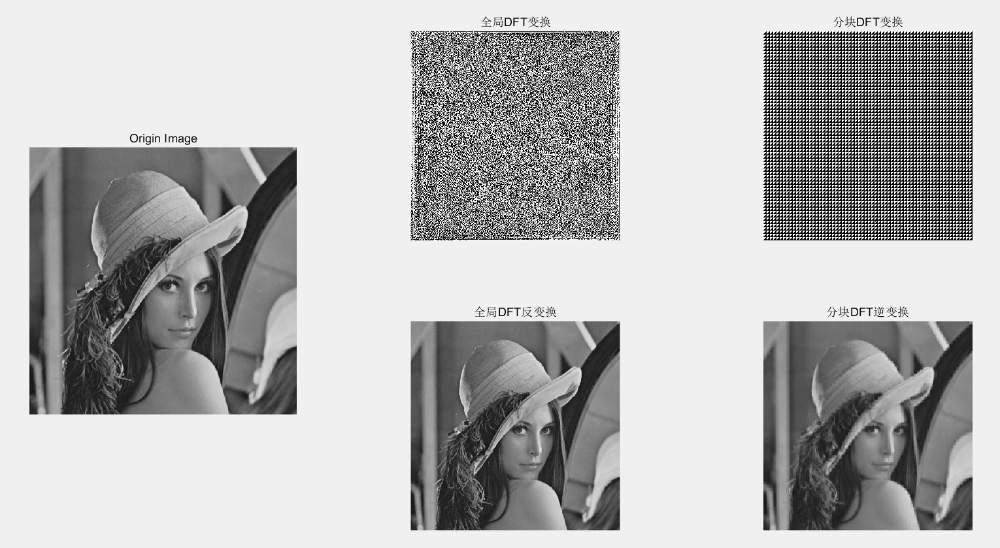

# DCT-and-DFT-Transform
### How to run:

- run file "DCT_main.m" to view the result of DCT transform
- run file "DFT_main.m" to view the result of DFT transform

### Result:

DCT Transform

DFT Transform

